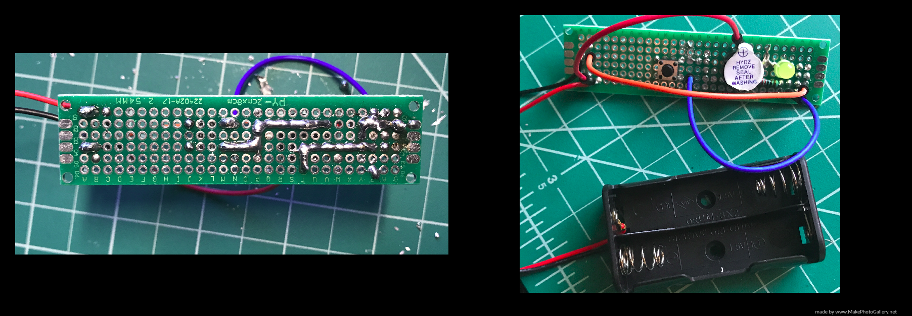

<h1> Doorbell-Circuit</h1>

<h2>Tools</h2>
<ul>
  <li>Soldering Iron</li>
  <li>Solder</li>
  <li>Male to Male Jumper Wires</li>
  <li>Perfboard</li>
  <li>LED</li>
  <li>Button</li>
  <li>2 AA Battery Pack</li>
  <li>Piezo Electric Buzzer</li>
  <li>1 2.2 k&#8486; resistor</li>
</ul>  

<h2>Motivation for the Project</h2>

My first functioning soldering project is this doorbell circuit I crafted on a perfboard. However, it took three failed attempts to make it correctly since I faced difficulty creating the solder joints to the leads of the battery pack, so what I did to resolve this issue was to solder wires to complete the connections between components, which worked well. As seen in the second picture when the batteries are placed in the battery pack all that must be done to activate the buzzer is pressing the button in the middle, which will also cause the LED to light indicating the buzzer is on. 

In my failed attempts, cold solder joints and excessive solder were my demise, so this time I was quick with the soldering iron and tinning the tip after each connection to ensure the solder would stay in place rather than joining in one spot. Creating this doorbell circuit inspires me to take future soldering projects, which I recently discovered there are an abundance of soldering kits online to take on.

